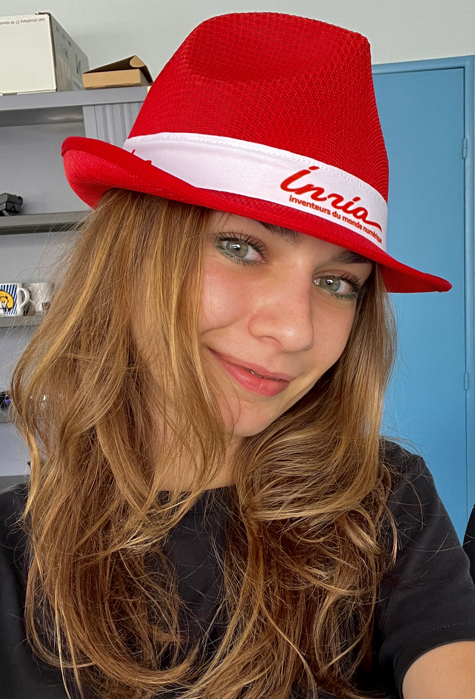

@def title = "About me"
@def tags = ["syntax", "code"]

## Hello!

#### I'm *Aurora Rossi*.

~~~
 
 ~~~
I'm a PhD student at [DS4H Université Côte d’Azur](https://ds4h.univ-cotedazur.eu/) in the [COATI](https://team.inria.fr/coati/) project joint-team between [Inria centre at Université Côte d’Azur](https://www.inria.fr/en/inria-centre-universite-cote-azur) and the [I3S Laboratory](https://www.i3s.unice.fr/en) under the supervision of [David Coudert](http://www-sop.inria.fr/members/David.Coudert/index.shtml) and co-advising of [Emanuele Natale](https://natema.github.io/ema-webpage/). 

I'm working also with the [ATHENA team](https://team.inria.fr/athena/).

### Conctact
Github username: [@aurorarossi](https://github.com/aurorarossi)

E-mail: aurora.rossi (at) inria.fr

Linkedin: [Aurora Rossi](https://www.linkedin.com/in/aurora-rossi-420b5616a/)
